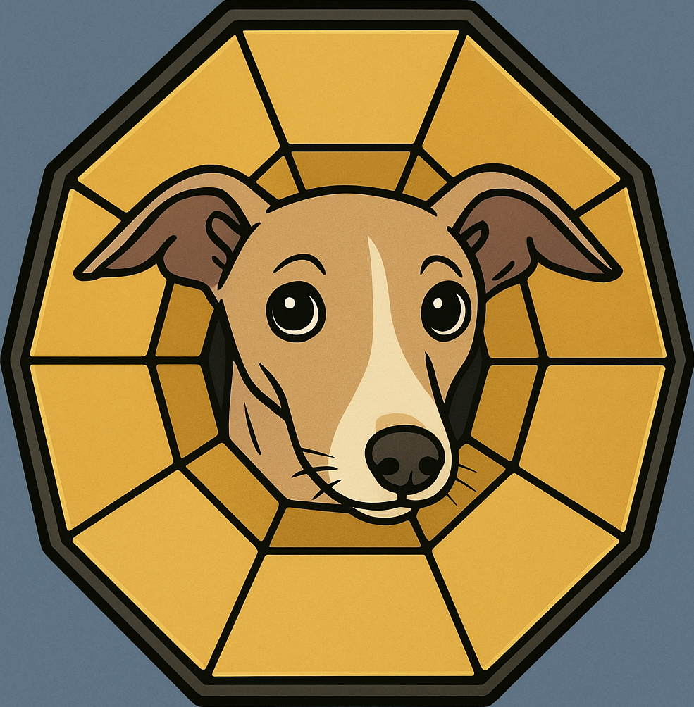
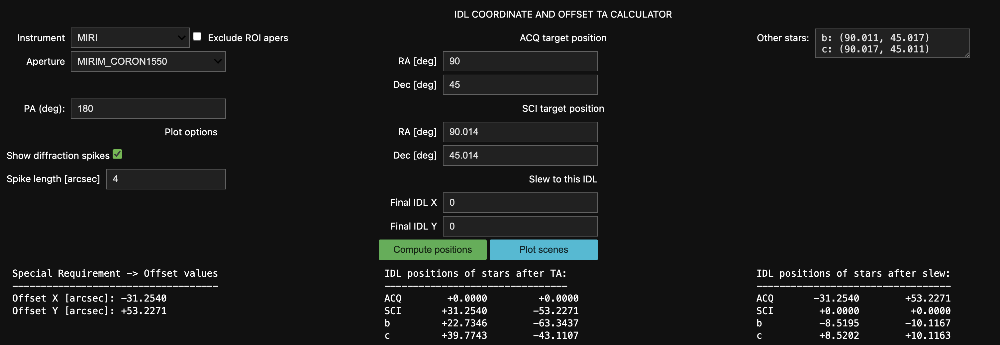
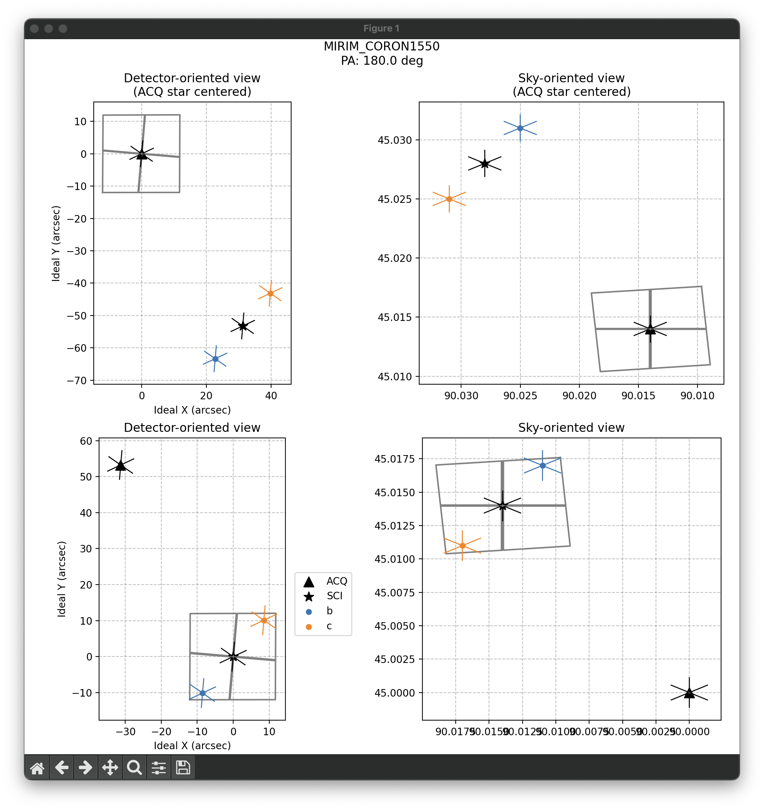

[^1]

# WHIPPOT

Webb's Helpful Ideal-coordinate Predictor for Positions, Offsets, and Traces!

Author: Jonathan Aguilar (jaguilar@stsci.edu)

## Overview

WHIPPOT helps you visualize how your observations will appear on a given JWST
instrument by projecting your targets' RA and Dec coordinates onto the
instrument's internal coordinate system[^2] for a given orientation of the
telescope on the sky. This is useful in a number of cases:
- checking the scene for a particular telescope orientation,
- computing an X/Y offset APT command to place a target at a desired location in
  the FOV,
- computing X/Y offset APT commands for manual target acquisition offsets,
- checking the overlap of spectral traces,
- avoiding diffraction spikes,
- scene simulation with STPSF[^3],
- placing a target in one observation at the position of a target in another to
create a PSF reference for subtraction, and probably more.

## Setup

### Requirements
- jupyterlab
- ipywidgets
- numpy
- matplotlib
- astropy
- pySIAF

The WHIPPOT uses ipywidgets to display the GUI, and therefore must be run in a
Jupyter notebook if the GUI is desired. Setup for Jupyter can be found
[here](https://jupyter.org/).

### Without installation

WHIPPOT can be run from a python file in a local directory, if installing
WHIPPOT is not desired. This mode is no longer developed, but provides basic
functionality.
- From the [github](https://github.com/STScI-MIRI/whippot) page, locate the
  branch selection drop-down menu at the top right and select `run_from_file`.
- Copy the file `whippot/whippot_tools.py` to the working directory.
- You can also copy an example notebook from the `notebooks` directory. In this
  case, the statement to import `whippot_tools` must be changed to `import
  whippot_tools`.


### With installation
1. Download the repository from [^1](https://github.com/STScI-MIRI/whippot) to
   your computer.
2. Navigate to the top-level directory, and run `pip install .`.
   - If you plan to make your own modifications, use `pip install -e .` instead
     (but you should probably fork the repo first).
   - This enables import via `from whippot import whippot_tools`.
   - Copy the tutorial notebooks to your working directory.

## Design overview

WHIPPOT represents an attempt to write a user-friendl[y/ier] interface to the
immensely useful pySIAF[^4] package. pySIAF is a python library that interfaces
with the Science Instrument Aperture File (SIAF), a document that contains the
location of every "aperture" in the telescope. For the purposes of this README,
the term "aperture" is used in the following non-standard sense defined in the
SIAF definition document:

> The SIAF captures certain basic geometric characteristics (in various frames)
> of the usable modes, subarrays, coronagraphs, physical apertures, etc., or
> stated generally, any unique targetable fiducial point and its associated
> region, used in support of JWST science operations. So in the context of the
> SIAF the term aperture is used in this broad sense.

pySIAF not only reads from the SIAF to retrieve the locations of every aperture,
but also provides tools to transform between the different telescope coordinate
systems (including sky coordinates, after defining a telescope orientation).

At the center of WHIPPOT is the `ComputePositions` class, defined in
`whippot/whippot_tools.py`. This class reads in the RA and Dec of the
user-provided targets and position angle (PA) of the telescope. It uses the
telescope PA to define an orientation matrix, which is then used by various
pySIAF functions to determine where a particular RA and Dec coordinate would
fall on a given aperture's field of view. `ComputePositions` is designed to be
very generic, so it will work for any given aperture on the telescope but may
not provide a great deal of useful information. WHIPPOT has been extended by
creating subclasses of `ComputePositions` (see the various files in the
`modes` folder) that overlay mode-specific information on the plots generated
by the parent `ComputePositions` class.

## Usage

### Generic interface

A generic introduction to different ways of interacting with WHIPPOT is provided
in [WHIPPOT_tutorial.ipynb](notebooks/WHIPPOT_tutorial.ipynb). It is designed to
display a GUI in the output of a Jupyter notebook cell. To get started simply
run the following code in a Jupyter notebook in a python environment where
WHIPPOT has been installed:

```
from whippot import whippot_tools
cp = whippot_tools.ComputePositions()
cp.ui
```

The last line, `cp.ui`, returns the ipywidgets GUI to the notebook cell output,
where it is then displayed (this is what the ipywidgets library is designed to
do). You can then enter your observing parameters and press the `Compute
Positions` button to get the IDL coordinates of the sources in your scene. If
you have a TA target that is different from your final science target, WHIPPOT
will also give you the coordinates of the sources in the TA image (if there are
2 TA images, then only the final one). Plot the scenes with `Plot scenes`. Note
that if you change any parameters, you must re-run `Compute Positions` before
the plots will update.

The following image shows the GUI interface and corresponding text output:



These are the corresponding plots:




A note on multiple calculations: Once you create a `ComputePositions` instance,
all references to it in the code will refer to the same instance. Jupyter
notebook cells have the (dis)advantage that they can be run out of order. If you
re-use the `ComputePositions` instance and change the parameters, the parameters
will also change in all cells where the instance is called. For this reason, it
is recommended to create multiple `ComputePositions` instances if you wish to
e.g. use the positions of sources in one observation to compute the positions of
sources in a subsequent observations.

#### Explanation of fields

- Instrument : one of the JWST instruments ('NIRCAM', 'NIRSPEC', 'NIRISS',
  'MIRI', or 'FGS')
- Aperture : the SIAF-defined name of the part of the telescope whose reference
  position will be pointed at the SCI target. Choose from the drop-down menu.
  - This might be large. Check the "Exclude ROI" box to reduce the number of
    entries.
  - You might need help figuring out what they mean. Try looking for the
    APERTURE header keyword of previous data, or asking an experienced user.
- PA (deg) : the PA angle of the V3 axis of the telescope *at the location of
  the aperture*. This corresponds to the `ROLL_REF` keyword, not the `P3_VA`
  (see below).
- ACQ target position RA/Dec : the RA and Dec positions of the target used for
  Target Acquisition, in decimal degrees
- SCI target position RA/Dec : the RA and Dec positions of the final science
  target, in decimal degrees
- Other stars : a mutliline string containing a label and decimal-degree
  coordinates for any other targets whose positions you wish to know. The format
  is: "label: (ra, dec)".
- Final IDL X/Y: After TA, this is where you want your SCI target to end up (in
  IDL X/Y arcsec, corresponding to APT's "Special Requirements -> Offsets"
  option).
- Additionally, there are plotting options:
  - Show diffraction spikes: toggle to plot the orientations of the diffraction
    spikes. The field "Spike length" sets their length, in arcsec.


#### Initialization dictionary keywords

`ComputePositions` instances can also be initialized with a configuration
dictionary, instead of setting each field by hand. This is useful for
repeatability and record-keeping. These are the available keywords, and the
field above to which they correspond:

- `instr` -> Instrument
- `sci_aper` -> Aperture
- `pa` -> PA angle
- `final_idl_x` -> Final IDL X
- `final_idl_y` -> Final IDL Y
- `sci_ra` -> SCI target position / RA [deg]
- `sci_dec` -> SCI target position / Dec [deg]
- `acq_ra` -> ACQ target position / RA [deg]
- `acq_dec` -> ACQ target position / Dec [deg]
- `other_stars` -> Other Stars
- `exclude_roi` -> do not list apertures defined as "Regions of Interest", which
  do not correspond to detector regions that can be read out.
- `show_diffraction_spikes` -> Plot diffraction spikes around each source
- `diff_spike_len` -> length of the diffraction spikes in arcsec

### Non-interactive mode ###

WHIPPOT can be used in non-interactive mode without the UI, either from the
terminal, a notebook, or a script, simply by not calling the GUI. Instantiating
a `ComputePositions` instance with an initialization dictionary will
automatically trigger the `ComputePositions.compute_positions()` method that
populates the `idl_coords_after_ta` and `idl_coords_after_slew` attributes. To
show the scene plots, simply call `plot_scene()`, which returns a reference to
the generated figure. `compute_positions()` reads from the
`ComputePositions.parameter_values` dictionary, so that can be modified to
re-compute with different values. However, in this case it must be called with
the `update_params_from_widgets=True` argument to prevent being overridden by
the (hidden) widget values.

### Modules for specific observing modes

While the basic WHIPPOT interface works with any aperture on Webb, a few
observing modes enumerated below have data overlays that provide more specific
information. They can be used by substituting `whippot_tools.ComputePositions()`
for `whippot.modes.[[mode_name]].ComputePositions()`. Available modes can be
listed with the command `whippot_tools.list_available_modes()`.

  * MIRI Coronagraphy
    - `whippot/modes/miri_coron_tools.py`
    - Shows both the illuminated aperture and the full readout aperture.
  * MIRI LRS Slitless Spectroscopy
    - `whippot/modes/miri_lrs_slitless_tools.py`
    - Shows approximate positions spectral traces.
    - Overlays the SLITLESS_UPPER and SLITLESS_LOWER apertures.
  * MIRI Wide-field Slitless Spectroscopy
    - `whippot/modes/miri_wfss_tools.py`
    - Shows approximate positions spectral traces
  * MIRI MRS
    - `whippot/modes/miri_mrs_tools.py`
    - Shows footprint of all 4 MRS channels.
    - Shows footprints of slices for the selected channel.
  * NIRCam Coronagraphy
    - `whippot/modes/nircam_coron_tools.py`
    - Filters the very, very long list of NIRCam aperture names down to the ones
      relevant for coronagraphy
  * NIRSpec IFU
    - `whippot/modes/nirspec_ifu_tools.py`
    - Shows overall IFU footprint as well as individual slices.

### A note on FOV masks

You may notice that the plots for a few modes indicate particular regions of the
field of view - for example, the coronagraph modes show the occulting masks.
These are defined in the files `aperture_mask_functions.py` and
`list_of_masks.py`. You are welcome (encouraged) (please help) to contribute to
these masks! The way it works is this: `aperture_mask_functions.py` contains
functions that generate `matplotlib.patches.PathPatch` objects. This is required
for the transformations of the masks between detector and sky coordinates to
work. The file `list_of_masks` contains a dictionary where each key is the name
of an aperture. The entry is a _function_ that generates an instance of that
mask. (it is done this way because each time a mask is overlaid on a plot, a new
instance of the mask is required). Follow the examples to add a new mask
generating function for an aperture.

## Notes, Tips and Tricks ##

- Offset TA: If, for some reason, you cannot use the built-in APT template for
  target acquisition on something other than your science target, place the RA
  and Dec of the ACQ and SCI stars into the corresponding fields and press
  "Compute Positions". In APT, navigate to the "Special Requirements -> Offset
  values" field and enter the Offset X and Y output from WHIPPOT.
- Scene simulation: STPSF (https://stpsf.readthedocs.io/) generally works in
  ideal coordinates, not detector pixels. You can use WHIPPOT to compute the IDL
  positions of the objects in some astrophysical scene for a given position
  angle, and then provide those coordinates to STPSF to simulate the point
  sources.

### Positions ###

#### Propagating positions to multiple epochs
For targets with high proper motion, the user will have to propagate it
  themselves to the observing epoch. This can be done with astropy's SkyCoord
  tools ([SkyCoord
  documentation](https://docs.astropy.org/en/stable/api/astropy.coordinates.SkyCoord.html)).
  This gives considerable flexibility in specifying the coordinates; for
  example, by providing a distance and proper motions, the user can propagate
  the positions using `SkyCoord.apply_space_motion()` to compute offsets for
  multiple epochs. Each offset value is pinned to a particular observing epoch.
  The user will have to carefully assess their error budget corresponding to how
  much sources might move, and how much positional error their observing mode
  can tolerate.
  
#### Getting RA and Dec for exoplanets given a relative position

Another use for SkyCoord functionality is for exoplanet systems where the
position is defined relative to the primary. After creating a SkyCoord object
for the primary, the RA and Dec of the planet(s) can be derived using
`SkyCoord.spherical_offset_by(delta_ra, delta_dec)` or
`SkyCoord.primary.directional_offset_by(sep, pa)`.


### Position angles

WHIPPOT uses the position angle of the telescope's V3 axis *at the reference
position of the aperture used for the observation*. If that sounds confusing,
the short version is it corresponds to the angle in APT's `Special Requirements
-> PA -> PA Range` menu if the `V3PA` radio button is selected. This value, in
turn, corresponds to the `ROLL_REF` header keyword (see the [JWST Keyword
Dictionary](https://mast.stsci.edu/portal/Mashup/Clients/jwkeywords/) for
keyword definitions). Due to spherical trigonometric effects, the PA of the V3
axis varies across the telescope's focal plane and varies strongly at high and
low latitudes. If you are using this library to plan observations in APT, the
`V3PA` field should match your `v3pa` variable.

This is not to be confused with the `PA_APER` header keyword, which corresponds
to the `Aperture PA Range` radio button and refers to the amount by which the
*detector*-aligned coordinate system is rotated with respect to the `V3` axis.
It also is not to be confused with the `PA_V3` header keyword, which refers to
the V3 position angle at the position of the telescope boresight.

Offset slews are specified along the detector axes, in units of arcsec (see
https://jwst-docs.stsci.edu/jppom/special-requirements/general-special-requirements).
In order to convert between the detector coordinate system and positions on the
sky, pySIAF requires information about the orientation of the telescope. Here,
we provide this information using a combination of the aperture used (see
`sci_aper`), and position angle of the v3 axis of the telescope, measured at the
chosen coronagraph's reference position.

More details about the different coordinate systems used in describing positions
in the telescope can be found here:
https://jwst-docs.stsci.edu/jwst-observatory-characteristics/jwst-observatory-coordinate-system-and-field-of-regard/

## FAQs for creating your APT program ##

### How do I choose my acquisition target? ###

To choose an acquisition target, you should consider the brightness, separation,
and position angle:
- Brightness: it should be bright enough to achieve high SNR in the TA filter
  without saturating (see the [ETC](https://jwst.etc.stsci.edu/)).
- Separation : it should be closer than the [visit-splitting
  distance](https://jwst-docs.stsci.edu/jwst-astronomers-proposal-tool-overview/additional-jwst-apt-functionality/apt-visit-splitting),
  which ranges between 30"-80" depending on the availability of guide stars for
  a particular target.
- Position angle: The acquisition target must be clear of diffraction spikes
  from nearby sources. This is especially important if the science target is
  very bright. [STPSF](https://stpsf.readthedocs.io/) can be used to determine
  if your TA target will be clear of the diffraction spikes. You can place the
  field stars into your simulated imaging by providing the IDL coordinates
  computed by WHIPPOT for a given PA.

### How do I choose dates and V3PA angles? ###

To see available dates and V3PA angles, go to the Visit Planner window in APT
and find the `Reports` menu at the bottom. Select a visit, and then select
`Total Roll Analysis for Visit`. This will give you a plot of available V3 PA
angles against dates, as well as a table that can be read into a script.

### Do I need to calculate a separate offset for each roll? ###

Yes, unless your roll angle is very small or your acquisition target is very
close.

### How to I place my SCI target at the position of one of the field targets in a separate observation?

This situation may arise, for example, in a high contrast imaging scenario where
you have a nearby bright star (let's call it, BS) in field of view of your
science observation, and you wish to create a PSF reference observation at the
matching position on the detector, in order to subtract it out. Let's call the
science observation with the interloper Obs 1, and the PSF reference
observation, Obs 2.

For Obs 1, you would create a `ComputePositions` object and save it to a
variable, like so: `ob1 = ComputePositions()`. Fill the ACQ and SCI RA/Dec
fields as normal, and add "BS: (bs.ra, bs.dec)" to the "Other stars" entry.
Press "Compute positions" to get the IDL coordinates of BS in your science
observation.

Then, create a new `ComputePositions` object for Obs 2: `obs2 =
ComputePositions()`. For the SCI field, enter the RA and Dec of your PSF
reference star, and then enter the IDL X and Y of BS into the "Final IDL X" and
"Final IDL Y" fields. These are accessible by copy-pasting from the output of
Obs 1, or by reading from the `obs1.idl_coords_after_slew['bs']` tuple. Press
`Compute Positions` to get the values to input into APT's Special Requirements
field. If the ACQ and SCI targets are the same, these values will be the same as
the Final IDL X/Y values, but if the ACQ and SCI targets are different, they
will not be.

## License

See `LICENSE.rst` for more information.

## Contributing

We love contributions! WHIPPOT is open source, built on open source, and we'd
love to have you hang out in our community. I am not an expert in all the JWST
observing modes, so I encourage you to subclass WHIPPOT and make a new display
tailored to the information that is useful to you.

**Imposter syndrome disclaimer**: We want your help. No, really.

There may be a little voice inside your head that is telling you that you're not
ready to be an open source contributor; that your skills aren't nearly good
enough to contribute. What could you possibly offer a project like this one?

We assure you - the little voice in your head is wrong. If you can write code at
all, you can contribute code to open source. Contributing to open source
projects is a fantastic way to advance one's coding skills. Writing perfect code
isn't the measure of a good developer (that would disqualify all of us!); it's
trying to create something, making mistakes, and learning from those mistakes.
That's how we all improve, and we are happy to help others learn.

Being an open source contributor doesn't just mean writing code, either. You can
help out by writing documentation, tests, or even giving feedback about the
project (and yes - that includes giving feedback about the contribution
process). Some of these contributions may be the most valuable to the project as
a whole, because you're coming to the project with fresh eyes, so you can see
the errors and assumptions that seasoned contributors have glossed over.

*Note:* This disclaimer was originally written by `Adrienne Lowe
<https://github.com/adriennefriend>`_ for a `PyCon talk
<https://www.youtube.com/watch?v=6Uj746j9Heo>`_, and was adapted by `whippot`
based on its use in the README file for the `MetPy project
<https://github.com/Unidata/MetPy>`_.

## Acknowledgments
We get by with a little help from our friends.

- The NIRCam and MIRI coronagraph masks are taken from the JWST Coronagraph
  Visibility Tool
  - https://github.com/spacetelescope/jwst_coronagraph_visibility
  - Authors: Christopher Stark, Joseph Long, J. Brendan Hagan, Mees Fix and
    Bryony Nickson
- Marshall Perrin's code contributions to the
  [breads](https://github.com/jruffio/breads) package
  - Specifically here:
    https://github.com/jruffio/breads/blob/main/breads/jwst_tools/planning.py
  - Code for showing diffraction spikes
  - Inspiration for displaying IFU apertures

[^1]: This logo was clearly made using an AI tool. If you get inspired to sketch
    a whippet wearing the JWST primary mirror like a post-surgical cone collar,
    I would love to use your drawing instead! I can even send you $20.

[^2]:
    https://jwst-docs.stsci.edu/jwst-observatory-hardware/jwst-target-observability-and-observatory-coordinate-system/jwst-instrument-ideal-coordinate-systems#gsc.tab=0

[^3]: https://stpsf.readthedocs.io/en/latest/

[^4]: https://pysiaf.readthedocs.io/
