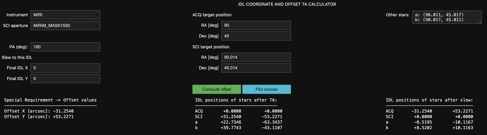

# WHIPPOT

Webb's Helpful Ideal-coordinate Predictor for Positions, Offsets, and Traces!

Author: Jonathan Aguilar (jaguilar@stsci.edu)

Last update: Oct 21, 2025

WHIPPOT helps users visualize how their observations will appear on JWST
instruments by translating their targets' RA and Dec coordinates into the
detectors' "ideal" coordinate system. Each JWST aperture has it's own "ideal"
coordinate system that is measured in arcseconds from an origin located at that
aperture's reference position. This is the coordinate system used in APT to
provided offset x and y special requirements. An example use case for WHIPPOT
might be to find out where a star will appear on the detector in one
observation, and then command the telescope in a second observation to put a
different star at that same position (for example, to serve as a PSF subtraction
reference). WHIPPOT is essentially a user-friendly wrapper around the very
useful and very powerful pySIAF library (<https://pysiaf.readthedocs.io/>).

## Setup ## 

### Requirements ###
- ipywidgets
- numpy
- matplotlib
- astropy
- pySIAF

### Installation ###

There are two ways to use these tools, after downloading the repository:
1. Navigate to the top-level directory, and run `pip install .`.
   - This enables import via `from whippot import whippot_tools`.
   - If you plan to make your own modifications, use `pip install -e .` (but you
     should probably fork the repo first)
   - Copy the tutorial notebooks to your working directory.
2. Nagivate to the `whippot` subfolder, and copy the notebook(s) from
   `notebooks/` and the `whippot_tools.py` scripts to whatever directory you
   plan to be working in.
   - In this case, the statement to import `whippot_tools` must be changed to
     `import whippot_tools`.
   - These files can also be copied directly from the online repository, without
     downloading the rest.
   - Note: this mode of usage deprecated, but still available if you switch to
     the `run_as_script` branch in the git repository. From the github page,
     locate the branch selection drop-down menu at the top right and select
     `run_as_script`.

## All-Instrument Interface Usage ##

For the purposes of this README, the word "aperture" is used in the same sense
as it is in the SIAF (Science Instrument Aperture File) - any defined region of
the telescope that can be used to command the telescope pointing. Some of these
"apertures" also correspond to subarrays that are read out as data.

The "All-Instrument Interface" is much easier to use than the previous
script-based version, and is recommended to be used instead. Some highlights,
while the README is slowly updated:
1. This is GUI-based, instead of script-based.
2. Any aperture can be chosen from any instrument, no longer just MIRI.
   Unfortunately, no help is given to the user to figure out which apertures are
   the correct ones to use. Some options are:
   - Guess based on the names;
   - Check the APERNAME keyword of data from the same observing configuration
     you plan to use;
   - Plot the aperture;
   - Poke around on JDox for any mentions of the SIAF;
   - Ask an experienced JWST user (_very_ experienced).
   - Generally, users are referred to the documentation here:
     https://pysiaf.readthedocs.io/
4. An initialization dictionary can be provided. If none is, the GUI will
   initialize with default values.
   - Initialization dictionaries are useful for repeatability.
   - To get a ist of viable keywords, instantiate an empty `ComputePositions`
     instance with `cp = whippot_tools.ComputePositions()` and check the
     `cp.parameter_values` dictionary
5. The SCI and ACQ target positions are intended for use with offset target
   acquisition (that is, TA is performed on a different target from the science
   target).
   - If performing self-TA, use the same coordinates for the ACQ and SCI
     position fields. The ACQ target will be dropped from plots and reports.
   - Also, the `acq_ra` and `acq_dec` fields can be omitted from the
     initialization dictionary, in which case the SCI target positions will be
     copied over.
5. If you want your SCI star to land somewhere in the aperture other than the
   reference position, enter this in arcsec into the "Final IDL X" and "Final
   IDL Y" positions. Read these as, "This is the final position (in IDL X and Y)
   where I want my SCI target to end up"., enter this in arcsec into the "Final
   IDL X" and "Final IDL Y" positions. Read these fields as, "This is the final
   position (in IDL X and Y) where I want my SCI target to end up".

!! Attention !! It is not recommended to use the same `ComputePositions`
instance for multiple calculations, because all references to a
`ComputePositions` instance in a notebook refer to the same object. Instead, if
you wish to compare the results of two calculations, create a new
`ComputePositions` object for each.

The following image shows the GUI interface and corresponding output:

### Explanation of fields ###

- Instrument : one of the JWST instruments ('NIRCAM', 'NIRSPEC', 'NIRISS',
  'MIRI', or 'FGS')
- SCI aperture : the SIAF-defined name of the part of the telescope whose
  reference position will be pointed at the SCI target. Choose from the
  drop-down menu. This might be large.
- PA (deg) : the PA angle of the V3 axis of the telescope *at the location of
  the aperture*. This corresponds to the `ROLL_REF` keyword, not the `P3_VA`
  (see below).
- ACQ target position RA/Dec : the RA and Dec positions of the target used for
  Target Acquisition, in decimal degrees
- SCI target position RA/Dec : the RA and Dec positions of the final science
  target, in decimal degrees
- Other stars : a mutliline string containing a label and decimal-degree
  coordinates for any other targets whose positions you wish to know. The format
  is: "label: (ra, dec)".
- Final IDL X/Y: After TA, this is where you want your SCI target to end up (in
  IDL X/Y arcsec, corresponding to APT's "Special Requirements -> Offsets"
  option).
- Additionally, there are plotting options:
  - Show diffraction spikes: toggle to plot the orientations of the diffraction
    spikes. The field "Spike length" sets their length, in arcsec.

### Initialization dictionary keywords ###

You may prefer to pass an initialization dictionary to the ComputePositions
object, instead of setting each field by hand. These are the available keywords,
and the field above to which they correspond:
- instr -> Instrument
- sci\_aper -> SCI aperture
- pa -> PA
- final\_idl\_x -> Final IDL X
- final\_idl\_y -> Final IDL Y
- sci\_ra -> SCI target position / RA [deg]
- sci\_dec -> SCI target position / Dec [deg]
- acq\_ra -> ACQ target position / RA [deg]
- acq\_dec -> ACQ target position / Dec [deg]
- other\_stars -> Other Stars

### Non-interactive mode ###

This can be used in non-interactive mode without the UI, either from the
terminal, a notebook, or a script, simply by not calling the GUI. Instantiating
a `ComputePositions` instance with an initialization dictionary will
automatically trigger the `ComputePositions.compute_positions()` method that
populates the `idl_coords_after_ta` and `idl_coords_after_slew` attributes. To
show the scene plots, simply call `plot_scene()`, which returns a reference to
the generated figure. `compute_positions()` reads from the
`ComputePositions.parameter_values` dictionary, so that can be modified to
re-compute with different values. To visualize the source positions, call the
`plot_scene()` method.

### Available mode-specific UIs ###

While the basic WHIPPOT interface works with any aperture on Webb, a few
observing modes enumerated below have data overlays that provide more specific
information. They can be used by substituting `whippot_tools.ComputePositions()`
for `whippot.modes.[[mode_name]].ComputePositions()`.

  * MIRI LRS Slitless Spectroscopy
    - `whippot/modes/miri_lrs_slitless_tools.py`
    - Shows approximate positions spectral traces
    - Overlays the SLITLESS_UPPER and SLITLESS_LOWER apertures.
  * MIRI Wide-field Slitless Spectroscopy
    - `whippot/modes/miri_wfss_tools.py`
    - Shows approximate positions spectral traces
  * MIRI MRS
    - `whippot/modes/miri_mrs_tools.py`
    - Shows footprint of all 4 channels.
    - Shows footprints of slices for the selected channel.

## Examples, Tips and Tricks ##

### Examples ###

- Offset TA: If, for some reason, you cannot use the built-in APT template for
  target acquisition on something other than your science target, place the RA
  and Dec of the ACQ and SCI stars into the corresponding fields and press
  "Compute Positions". In APT, navigate to the "Special Requirements -> Offset
  values" field and enter the Offset X and Y output from WHIPPOT.
- Scene simulation: STPSF (https://stpsf.readthedocs.io/) generally works in
  ideal coordinates, not detector pixels. You can use WHIPPOT to compute the IDL
  positions of the objects in some astrophysical scene for a given position
  angle, and then provide those coordinates to STPSF to simulate the point
  sources.
- Spectral trace overlap: Plot spectral traces for a set of sources

### Tips on PA and Positions ###

For targets with high proper motion, the user will have to propagate it
  themselves to the observing epoch. This can be done with astropy's SkyCoord
  tools ([SkyCoord
  documentation](https://docs.astropy.org/en/stable/api/astropy.coordinates.SkyCoord.html)).
  This gives considerable flexibility in specifying the coordinates; for
  example, by providing a distance and proper motions, the user can propagate
  the positions using `SkyCoord.apply_space_motion()` to compute offsets for
  multiple epochs. Each offset value is pinned to a particular observing epoch.
  The user will have to carefully assess their error budget corresponding to how
  much sources might move, and how much positional error their observing mode
  can tolerate.

#### Position angle ####

WHIPPOT uses the position angle of the telescope's V3 axis *at the reference
position of the aperture used for the observation*. If that sounds confusing,
the short version is it corresponds to the angle in APT's `Special Requirements
-> PA -> PA Range` menu if the `V3PA` radio button is selected. This value, in
turn, corresponds to the `ROLL_REF` header keyword (see the [JWST Keyword
Dictionary](https://mast.stsci.edu/portal/Mashup/Clients/jwkeywords/) for
keyword definitions). Due to spherical trigonometric effects, the PA of the V3
axis varies across the telescope's focal plane and varies strongly at high and
low latitudes. If you are using this library to plan observations in APT, the
`V3PA` field should match your `v3pa` variable.

This is not to be confused with the `PA_APER` header keyword, which corresponds
to the `Aperture PA Range` radio button and refers to the amount by which the
*detector*-aligned coordinate system is rotated with respect to the `V3` axis.
It also is not to be confused with the `PA_V3` header keyword, which refers to
the V3 position angle at the position of the telescope boresight.

Offset slews are specified along the detector axes, in units of arcsec (see
https://jwst-docs.stsci.edu/jppom/special-requirements/general-special-requirements).
In order to convert between the detector coordinate system and positions on the
sky, pySIAF requires information about the orientation of the telescope. Here,
we provide this information using a combination of the coronagraph used (see
`coron_id`), and position angle of the v3 axis of the telescope, measured at the
chosen coronagraph's reference position.

More details about the different coordinate systems used in describing positions
in the telescope can be found here:
https://jwst-docs.stsci.edu/jwst-observatory-characteristics/jwst-observatory-coordinate-system-and-field-of-regard/
.

## Extending WHIPPOT ##

### New observing modes ###

JWST has many different observing modes that could all use different overlays to
make their plots more informative. Examples for extending MIRI WFSS
functionality are shown in `miri_wfss_tools.py` and `miri_coron_tools.py`. Users
are welcome to contribute their own mode-specific modules! Make a new file named
after the mode and place it in the `whippot/modes/` directory. It may import
*from* `whippot_tools.py`, but should not be imported *to* `whippot_tools.py`.
If the number of such files becomes "large", we may restructure the directories.

The best way to extend WHIPPOT is to subclass the
`whippot_tools.ComputePositions` class and override its methods and attributes.
Examples can be seen in the files referenced above.

### New aperture masks ###

For many observing modes, it is helpful to visualize features of the field of
view like the occulting spots of coronagraphs. If your observing mode does not
have a mask defined, you can define one yourself in the two files
`aperture_mask_functions.py` and `list_of_masks.py`. Each mask is created as a
matplotlib Patch object that can be added to a matplotlib axis. Because of the
way matplotlib works, a single instance of a Patch object cannot be added among
multiple axes, meaning that multiple copies of each mask must be made for each
of the subplots in the default WHIPPOT output plot. Read below to see how this
is handles.

#### `aperture_mask_functions.py` ####

This module contains functions that all return a matplotlib Patch object. Each
function corresponds to a different aperture or class of apertures, e.g. the
MIRI four-quadrant phase mask coronagraphs.

#### `list_of_masks.py` ####

This function contains a dictionary called `list_of_masks`. Each entry is
indexed by an APERNAME keyword, and the value stored at that entry is a function
that generates the mask for that aperture. It is important that this be a
function, because it must be called to create a new mask instance for every plot
you want to make. This is handled by a wrapper called `mask_maker()`, which
takes as arguments a generator function and an instance of the aperture and
returns a new function that creates a matplotlib Patch instance when called with
no arguments.

## FAQs for creating your APT program ##

### How do I choose my acquisition target? ###

To choose an acquisition target, you should consider the brightness, separation,
and position angle:
- Brightness: it should be bright enough to achieve high SNR in the TA filter
  without saturating (see the [ETC](https://jwst.etc.stsci.edu/)).
- Separation : it should be closer than the [visit-splitting
  distance](https://jwst-docs.stsci.edu/jwst-astronomers-proposal-tool-overview/additional-jwst-apt-functionality/apt-visit-splitting),
  which ranges between 30"-80" depending on the availability of guide stars for
  a particular target.
- Position angle: The acquisition target must be clear of diffraction spikes
  from nearby sources. This is especially important if the science target is
  very bright. [STPSF](https://stpsf.readthedocs.io/) can be used to determine
  if your TA target will be clear of the diffraction spikes. You can place the
  field stars into your simulated imaging by providing the IDL coordinates
  computed by WHIPPOT for a given PA.

### How do I choose dates and V3PA angles? ###

To see available dates and V3PA angles, go to the Visit Planner window in APT
and find the `Reports` menu at the bottom. Select a visit, and then select
`Total Roll Analysis for Visit`. This will give you a plot of available V3 PA
angles against dates, as well as a table that can be read into a script.

### Do I need to calculate a separate offset for each roll? ###

Yes, unless your roll angle is very small or your acquisition target is very
close.

### How to I place my SCI target at the position of one of the field targets in a separate observation?

This situation may arise, for example, in a high contrast imaging scenario where
you have a nearby bright star (let's call it, BS) in field of view of your
science observation, and you wish to create a PSF reference observation at the
matching position on the detector, in order to subtract it out. Let's call the
science observation with the interloper Obs 1, and the PSF reference
observation, Obs 2.

For Obs 1, you would create a `ComputePositions` object and save it to a
variable, like so: `ob1 = ComputePositions()`. Fill the ACQ and SCI RA/Dec
fields as normal, and add "BS: (bs.ra, bs.dec)" to the "Other stars" entry.
Press "Compute positions" to get the IDL coordinates of BS in your science
observation.

Then, create a new `ComputePositions` object for Obs 2: `obs2 =
ComputePositions()`. For the SCI field, enter the RA and Dec of your PSF
reference star, and then enter the IDL X and Y of BS into the "Final IDL X" and
"Final IDL Y" fields. These are accessible by copy-pasting from the output of
Obs 1, or by reading from the `obs1.idl_coords_after_slew['bs']` tuple. Press
`Compute Positions` to get the values to input into APT's Special Requirements
field. If the ACQ and SCI targets are the same, these values will be the same as
the Final IDL X/Y values, but if the ACQ and SCI targets are different, they
will not be.

## License

See `LICENSE.rst` for more information.

## Contributing

We love contributions! `whippot` is open source, built on open source, and we'd
love to have you hang out in our community.

**Imposter syndrome disclaimer**: We want your help. No, really.

There may be a little voice inside your head that is telling you that you're not
ready to be an open source contributor; that your skills aren't nearly good
enough to contribute. What could you possibly offer a project like this one?

We assure you - the little voice in your head is wrong. If you can write code at
all, you can contribute code to open source. Contributing to open source
projects is a fantastic way to advance one's coding skills. Writing perfect code
isn't the measure of a good developer (that would disqualify all of us!); it's
trying to create something, making mistakes, and learning from those mistakes.
That's how we all improve, and we are happy to help others learn.

Being an open source contributor doesn't just mean writing code, either. You can
help out by writing documentation, tests, or even giving feedback about the
project (and yes - that includes giving feedback about the contribution
process). Some of these contributions may be the most valuable to the project as
a whole, because you're coming to the project with fresh eyes, so you can see
the errors and assumptions that seasoned contributors have glossed over.

*Note:* This disclaimer was originally written by `Adrienne Lowe
<https://github.com/adriennefriend>`_ for a `PyCon talk
<https://www.youtube.com/watch?v=6Uj746j9Heo>`_, and was adapted by `whippot`
based on its use in the README file for the `MetPy project
<https://github.com/Unidata/MetPy>`_.

## We get by with a little help from our friends
- The NIRCam and MIRI coronagraph masks are taken from the JWST Coronagraph
  Visibility Tool
  - https://github.com/spacetelescope/jwst_coronagraph_visibility
  - Authors: Christopher Stark, Joseph Long, J. Brendan Hagan, Mees Fix and
    Bryony Nickson
- Marshall Perrin's code contributions to the
  [breads](https://github.com/jruffio/breads) package
  - Specifically here:
    https://github.com/jruffio/breads/blob/main/breads/jwst_tools/planning.py
  - Code for showing diffraction spikes
  - Inspiration for displaying IFU apertures
